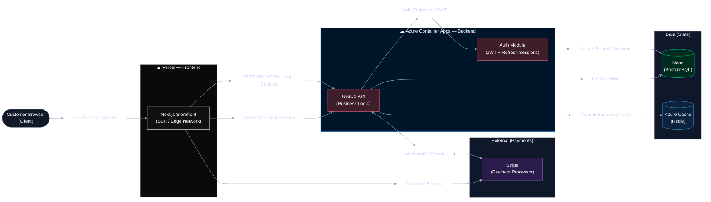

# Compute Billing Platform

Production-grade full-stack application featuring secure authentication, Stripe payments, background jobs, and modern frontend architecture.

---

## Deployment Status

[](https://vercel.com)
[](https://github.com/hua0-richard/gpu-store/actions/workflows/ci-cd.yml)
[](https://neon.tech)
[](https://azure.microsoft.com/products/cache)

---

## Demo


---

## Architecture


```mermaid
%%{init: {
  "theme": "base",
  "themeVariables": {
    "background": "#0b1020",
    "mainBkg": "#0b1020",
    "primaryTextColor": "#ffffff",
    "textColor": "#ffffff",
    "labelBackground": "rgba(0,0,0,0)",
    "edgeLabelBackground": "rgba(0,0,0,0)",
    "edgeLabelBorder": "rgba(0,0,0,0)",
    "edgeLabelBorderWidth": "0",
    "edgeLabelColor": "#ffffff",
    "lineColor": "#94a3b8",
    "clusterBkg": "#0b1020",
    "clusterBorder": "#334155",
    "clusterLabelColor": "#ffffff"
  }
} }%%

flowchart LR
    User(["Customer Browser<br/>(Client)"])

    subgraph Frontend["▲ Vercel — Frontend"]
        direction TB
        Web["Next.js Storefront<br/>(SSR / Edge Network)"]
    end

    subgraph Backend["☁ Azure Container Apps — Backend"]
        direction TB
        API["NestJS API<br/>(Business Logic)"]
        Auth["Auth Module<br/>(JWT + Refresh Sessions)"]
    end

    subgraph Data["Data (State)"]
        direction TB
        DB[("Neon<br/>(PostgreSQL)")]
        Redis[("Azure Cache<br/>(Redis)")]
    end

    subgraph External["External (Payments)"]
        direction TB
        Stripe["Stripe<br/>(Payment Processor)"]
    end

    L_User_Web["HTTPS / User Actions"]
    L_Web_API["REST API / JSON + Auth Cookies"]
    L_API_DB["Prisma ORM"]
    L_API_Redis["Event Idempotency Lock"]
    L_API_Auth["Auth Endpoints / JWT"]
    L_Auth_DB["Users + Refresh Sessions"]
    L_API_Stripe["Webhooks / Events"]
    L_Web_Stripe["Checkout Redirect"]
    L_API_Checkout["Create Checkout Session"]

    User --> L_User_Web --> Web
    Web --> L_Web_API --> API
    Web --> L_API_Checkout --> API
    API --> L_API_Auth --> Auth --> L_Auth_DB --> DB
    API --> L_API_DB --> DB
    API --> L_API_Redis --> Redis
    API <--> L_API_Stripe <--> Stripe
    Web --> L_Web_Stripe --> Stripe

    classDef neutral fill:#111827,stroke:#334155,color:#ffffff;
    classDef next fill:#111111,stroke:#ffffff,color:#ffffff;
    classDef nest fill:#3f1d2a,stroke:#fb7185,color:#ffffff;
    classDef neon fill:#002b1f,stroke:#00e599,color:#ffffff;
    classDef azurecache fill:#0c2340,stroke:#50abf1,color:#ffffff;
    classDef stripe fill:#2b1b4b,stroke:#a78bfa,color:#ffffff;
    classDef edgeText fill:transparent,stroke:transparent,color:#cbd5f5;

    class User neutral;
    class Web next;
    class API,Auth nest;
    class DB neon;
    class Redis azurecache;
    class Stripe stripe;
    class L_User_Web,L_Web_API,L_API_DB,L_API_Redis,L_API_Auth,L_Auth_DB,L_API_Stripe,L_Web_Stripe,L_API_Checkout edgeText;

    style Frontend fill:#0a0a0a,stroke:#ffffff,color:#ffffff,stroke-width:1px
    style Backend fill:#001529,stroke:#0078d4,color:#ffffff,stroke-width:1px
    style Data fill:#0f172a,stroke:#334155,color:#ffffff,stroke-width:1px
    style External fill:#0f172a,stroke:#334155,color:#ffffff,stroke-width:1px

    linkStyle default stroke:#94a3b8,stroke-width:1.5px
```

---

## Tech Stack

| Layer         | Technology                                |
| ------------- | ----------------------------------------- |
| Frontend      | Next.js, shadcn/ui, TypeScript            |
| Backend       | NestJS, Prisma, TypeScript                |
| Database      | PostgreSQL (Neon)                         |
| Cache / Locks | Redis (Azure Cache)                       |
| Payments      | Stripe                                    |
| Hosting       | Vercel (web), Azure Container Apps (API)  |
| CI/CD         | GitHub Actions → Azure Container Registry |

---

## Core Features

- User authentication with JWT access tokens and refresh token rotation
- Shopping cart with Stripe Checkout
- Webhook-driven payment lifecycle (signature verification + idempotency)
- Redis-backed distributed locking for payment events
- Background job processing with BullMQ

---

## Key Engineering Highlights

- Designed **token-based auth** with refresh tokens and multi-session support
- Enforced **clear service boundaries** in a NestJS modular architecture
- Used **Prisma migrations** for safe schema evolution
- Built **CI/CD pipeline** with GitHub Actions, Docker, and Azure Container Apps

---

## Local Development

### Prerequisites

- Docker
- [Stripe CLI](https://stripe.com/docs/stripe-cli) (for local webhook testing)

### Quick Start

```bash
docker compose up
pnpm db:seed:dev
# open http://localhost:3000
```

### Stripe Webhooks

```bash
stripe listen --forward-to localhost:3001/webhooks/stripe
```

### Test Card

Use the following Stripe test card to complete a payment:

| Field       | Value                          |
| ----------- | ------------------------------ |
| Card number | `4242 4242 4242 4242`          |
| Expiry      | Any future date (e.g. `12/34`) |
| CVC         | Any 3 digits (e.g. `123`)      |
| ZIP         | Any (e.g. `12345`)             |
